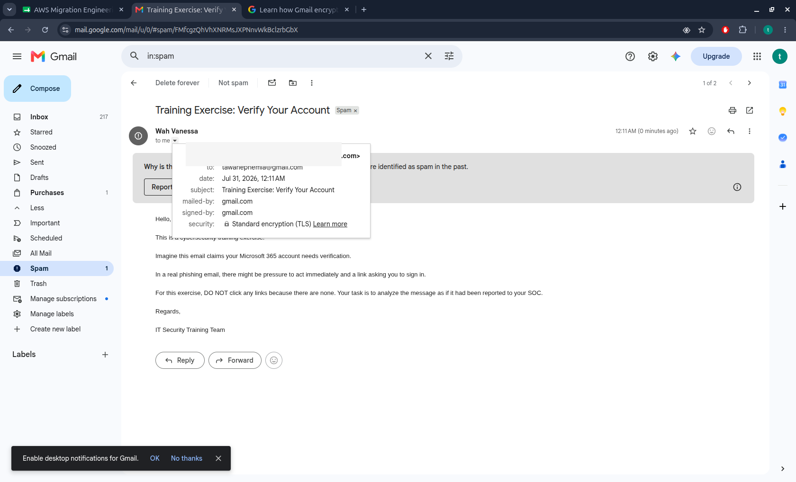
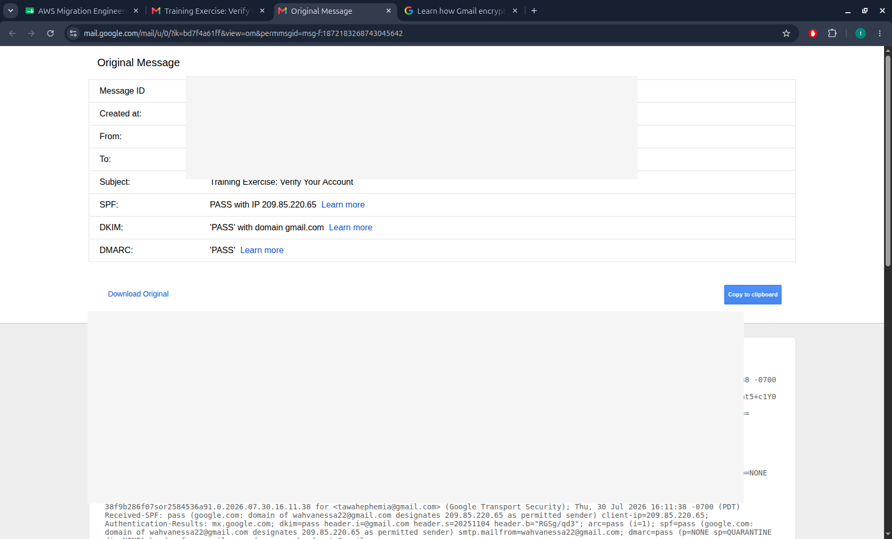
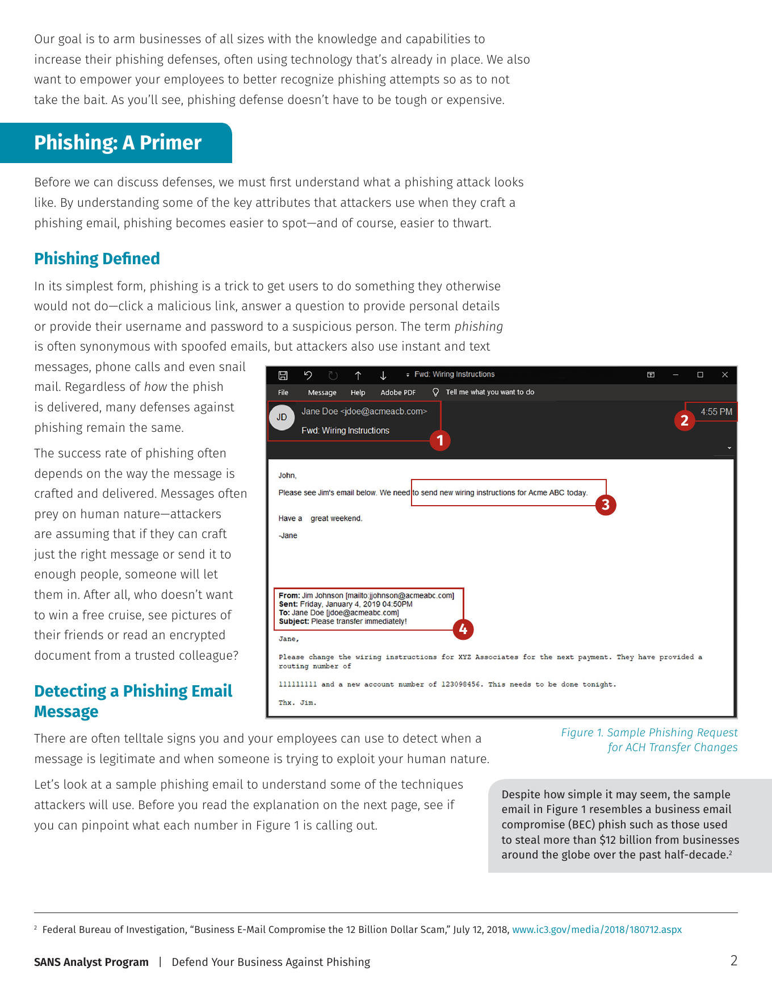
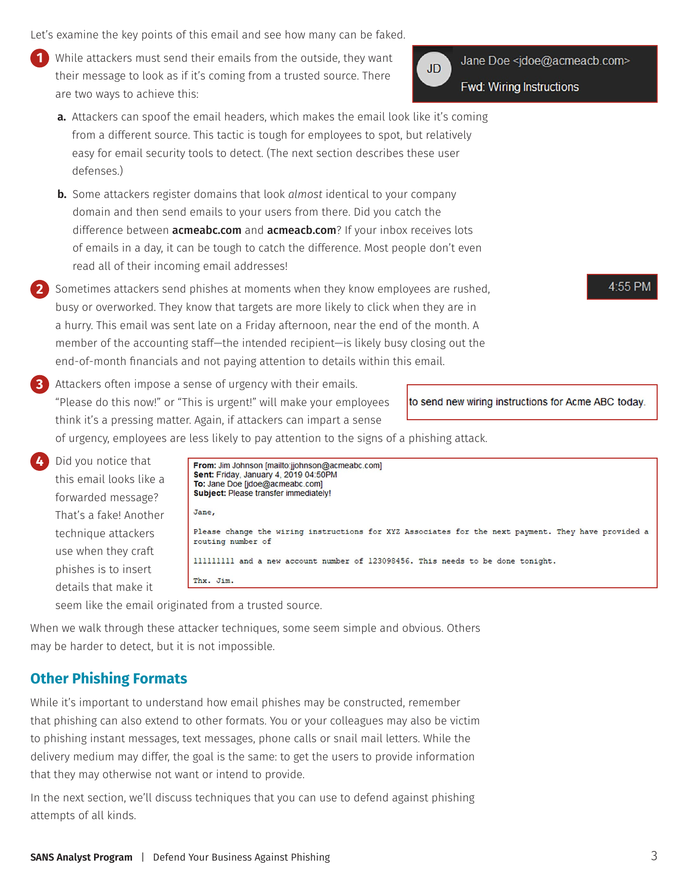

# Legitimate vs Phishing Email Analysis

A beginner-friendly SOC documentation project comparing:

1. A real, authenticated Gmail training email.
2. A public business email compromise (BEC) phishing sample published by the SANS Institute.

The project demonstrates evidence collection, email authentication review, phishing-content analysis, IOC documentation, reporting, and professional GitHub documentation.

## Case information

| Field | Value |
|---|---|
| Case ID | SOC-2026-0001 |
| Analyst | Wah Vanessa |
| Investigation type | Email security / phishing analysis |
| Status | Closed |
| Severity | Low - training exercise |
| Date | 31 July 2026 |

## Investigation question

> What differences can a SOC analyst observe between an authenticated legitimate email and a public phishing training sample?

## Scope

### Legitimate comparison email

A controlled Gmail-to-Gmail training message was sent between accounts owned by the analyst. Gmail generated real routing and authentication results:

- SPF: Pass
- DKIM: Pass
- DMARC: Pass
- Matching sender and Return-Path
- No links
- No attachments

Personal email addresses were sanitized in the repository evidence and screenshots.

### Public phishing sample

The phishing example comes from the SANS Institute paper *Defend Your Business Against Phishing* by Matt Bromiley (2019). The sample resembles business email compromise and requests a change to payment wiring instructions.

The SANS sample provides visible message content and an explanation of warning signs, but it does **not** provide a complete raw email header. Therefore, this project does not invent SPF, DKIM, DMARC, IP reputation, or routing results for the sample.

## Key findings

| Category | Legitimate training email | SANS phishing sample |
|---|---|---|
| Sender identity | Consistent Gmail sender | Look-alike domain used |
| Return-Path | Matches sender | Not available in source |
| SPF / DKIM / DMARC | All pass | Not available in source |
| Urgency | None | Payment change requested urgently |
| Financial request | None | New routing/account instructions |
| Trust manipulation | Clearly marked training email | Fake forwarded message and familiar names |
| Links / attachments | None | None shown in the sample |
| Final classification | Benign training email | Phishing / BEC training example |

## Repository structure

```text
.
├── README.md
├── LICENSE
├── .gitignore
├── evidence/
│   ├── legitimate-training-email/
│   │   ├── email-header.txt
│   │   └── analysis-notes.md
│   └── sans-phishing-sample/
│       ├── sample-description.md
│       ├── extracted-iocs.csv
│       └── analysis-notes.md
├── reports/
│   └── phishing-investigation-report.md
├── screenshots/
│   ├── legitimate-email.png
│   ├── legitimate-header-results.png
│   ├── sans-phishing-email.png
│   └── sans-phishing-analysis.png
├── docs/
│   └── investigation-methodology.md
└── resources/
    └── references.md
```

## Screenshots

### Legitimate training email



### Authentication results



### SANS phishing sample



### SANS explanation of warning signs



## Final assessment

The legitimate Gmail message passed SPF, DKIM, and DMARC, had consistent sender information, and contained no links or attachments. It was classified as a benign training message despite Gmail placing it in Spam.

The SANS sample demonstrates a business email compromise phishing pattern through a look-alike domain, time pressure, an urgent financial request, and a fabricated forwarded-message context. The appropriate response is to avoid acting on the request, verify it through a separate trusted communication channel, and escalate it to security or finance personnel.

## Ethical and safety statement

This repository contains no malware, credential-harvesting page, active malicious link, or real attack infrastructure. It is intended only for cybersecurity education and portfolio documentation.

## Source attribution

The phishing example and its explanatory screenshots are derived from the SANS Institute paper *Defend Your Business Against Phishing* (2019). See `resources/references.md`.
